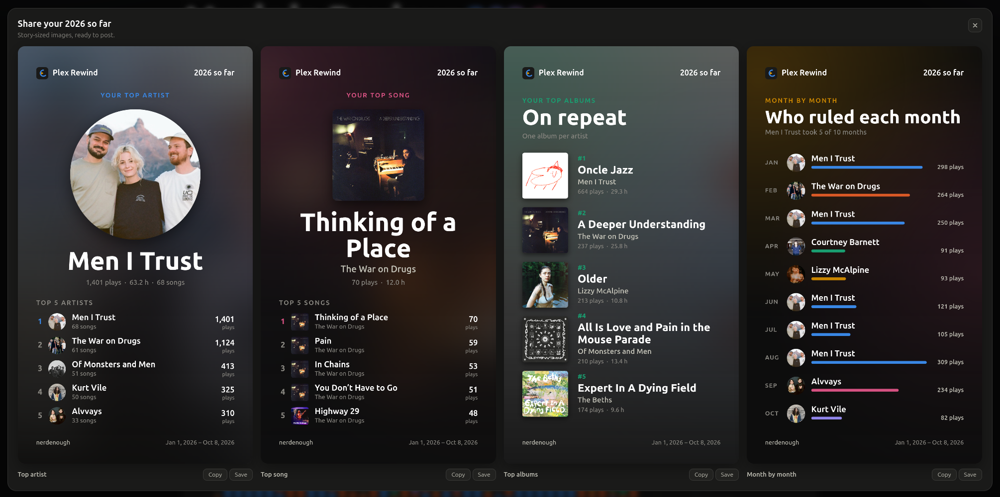
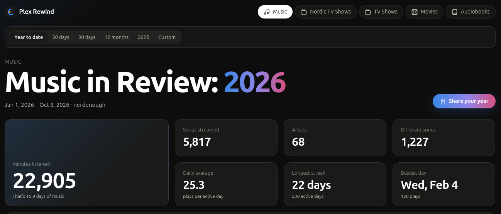
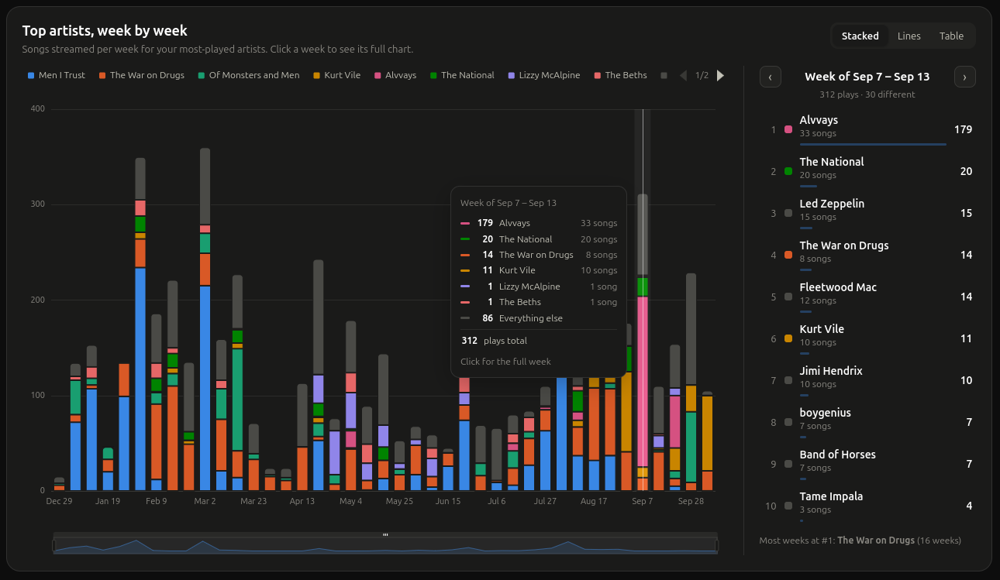
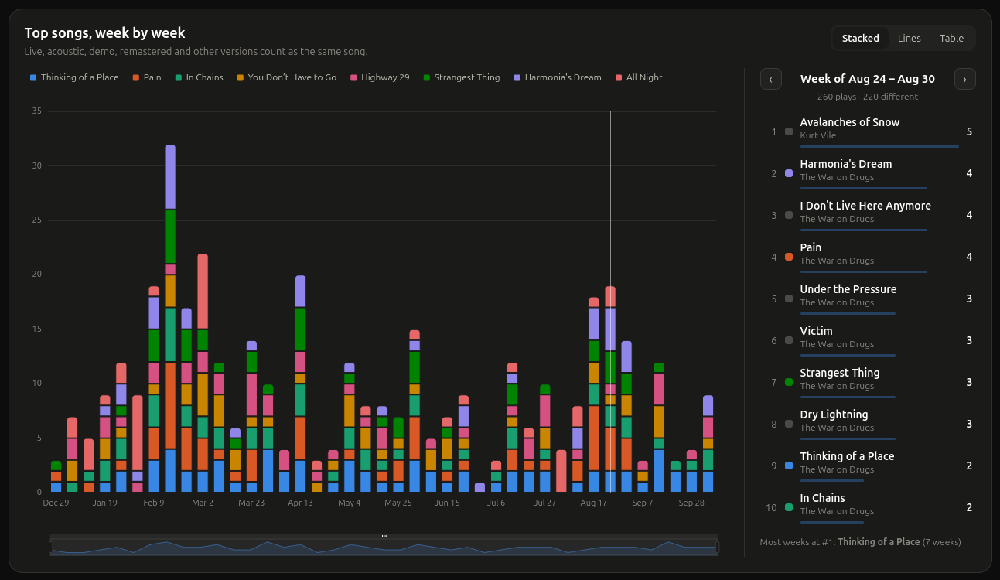
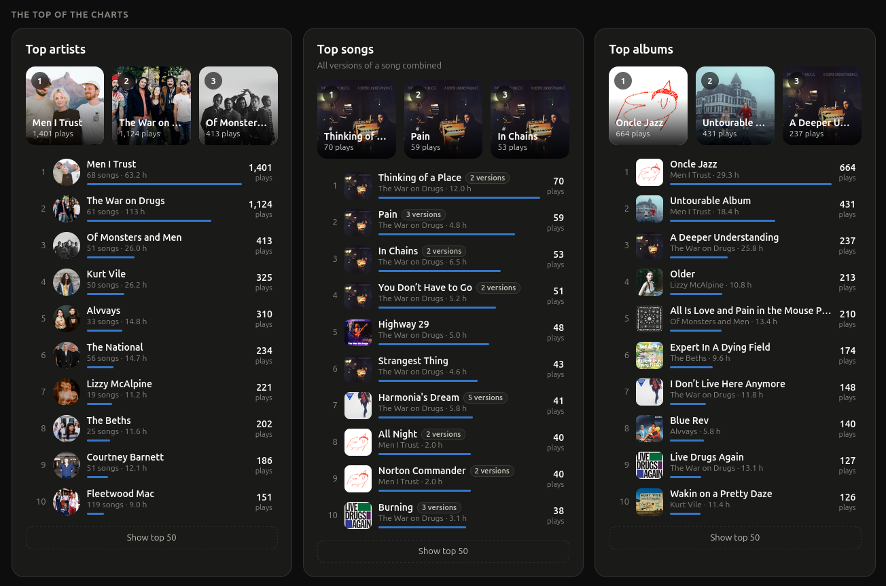
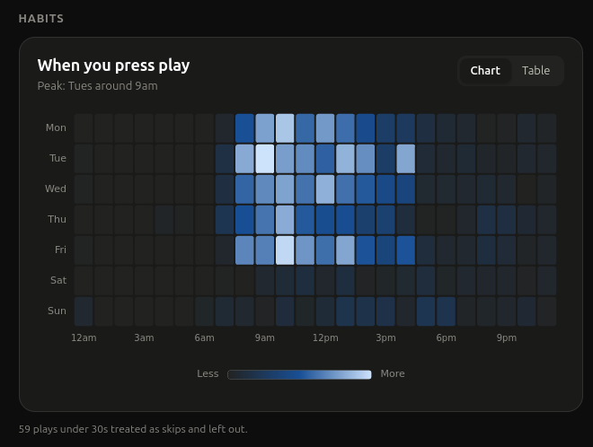
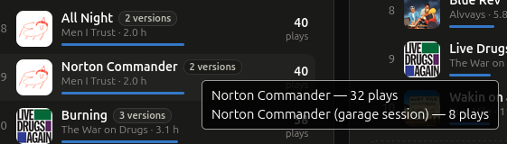

# Plex Rewind

_Note: This repo is vibe coded slop. It does what I want, and that's the main thing._

I mainly wanted a music rewind reminiscent to Spotify's, but ended up making a proper dashboard with some more interesting insights as well. Main use case is music, but works for any libraries like Movies and TV.

### Features

Kinda like Spotify rewind:



Top Section with page navigation per library on your Plex server:



Top artists, week-by-week:



Top songs, week-by-week:



Top stats.



Habits and most played on devices (not pictured).



## Some caveats

- I listen to a lot of different versions of the same songs, e.g. live, early takes, outtakes, etc. I wanted them to all count as the same song in the stats.



- This dashboard depends on [Tautulli](https://tautulli.com/) to be connected to the server you want to use this with.

## Setup

This part and below was written by AI, the above is the human stuff.

Create `.env` (gitignored) in the project root:

```sh
TAUTULLI_API_KEY=your-key          # Tautulli → Settings → Web Interface → API
TAUTULLI_URL=http://localhost:8181 # optional, this is the default
TAUTULLI_USER=username             # optional, this is the default; Plex username or Tautulli friendly name
```

Then:

```sh
pnpm install
pnpm dev        # http://localhost:5173
```

The browser never sees the API key. The Vite server proxies `/tautulli?cmd=…` to Tautulli's `/api/v2` and adds the key. Because of that, run it with `pnpm build && pnpm preview` rather than serving `dist/` from a static host.

## Notes

- Only `TAUTULLI_USER`'s plays are shown, across every library.

- Music plays shorter than 30 seconds count as skips and are left out. Audiobook chapters under 60 seconds are left out too.
- History is fetched with Tautulli's grouping on, so a resumed session counts as one play.
- Song title cleanup lives in `src/lib/normalize.ts`; per-library charts and stats are configured in `src/views/configs.ts`.
